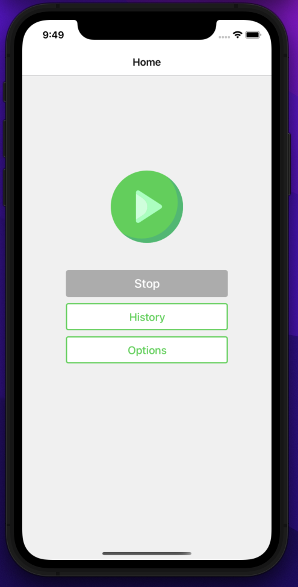
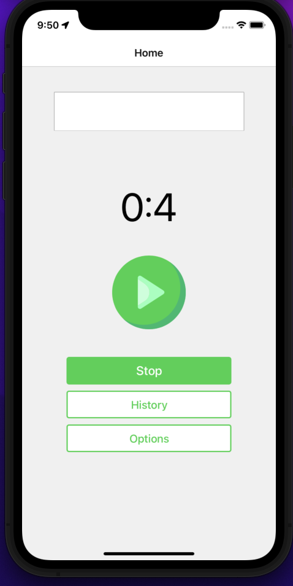
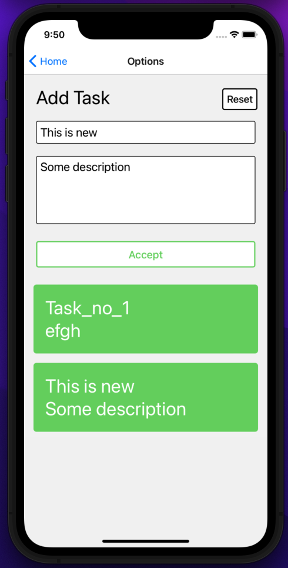
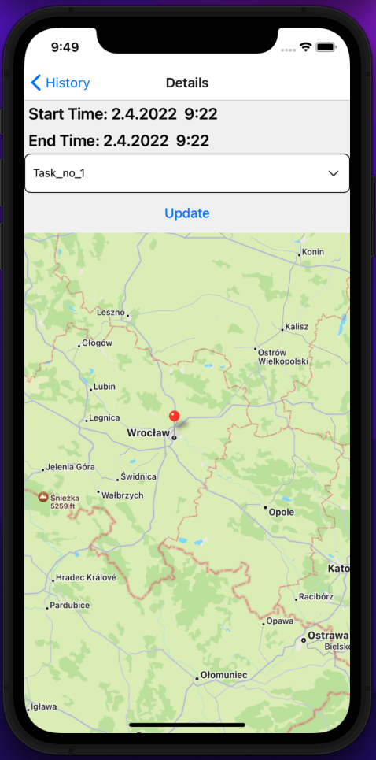

## Desciption

This is a first application in React Native. Just to try it out. It helps tracking time spent on tasks. Grouping work sessions by tasks. Also records GPS position while starting the tasks.

### Homescreen

### Task started

### Adding tasks

### Display position

